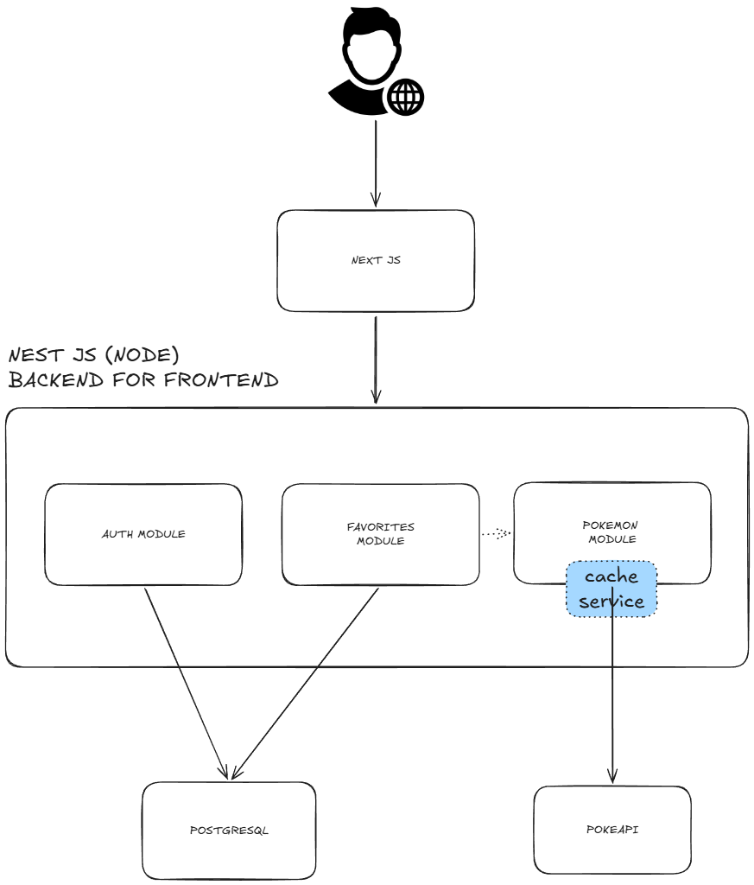
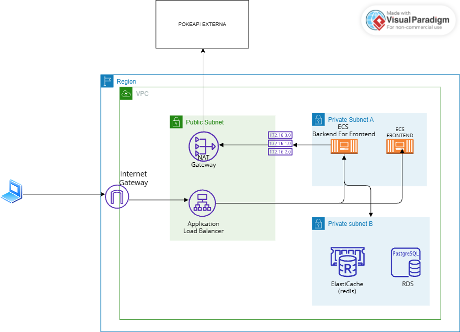
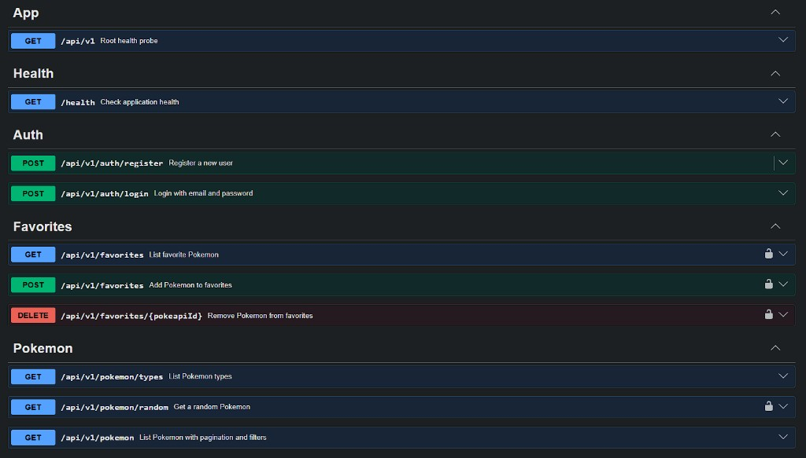

# ixp-pokemon

Prueba técnica Pokémon — **Next.js** (frontend) + **NestJS** (BFF) + **PostgreSQL** + **PokeAPI**.

El front consume exclusivamente el backend; el backend es quien habla con PokeAPI y la base de datos. Ambos comparten el contrato **JSend** para requests y respuestas.

---

## Por qué está hecho así (Sistema - Backend)

> La idea es empezar mostrando el razonamiento

### El servicio semilla (la primera idea)

Primero quise hacer que el backend use un **servicio semilla** para poblar la base de datos. Al ser un catálogo casi estático el de PokeAPI, así evitaba depender de un servicio externo en cada request y lograba persistir los datos como los quería porque además, las respuestas de la PokeAPI **no satisfacen con una sola consulta** los parámetros que requería el front — hay que combinar listado, detalle, tipos, filtros, etc.

### Por qué no seguí por ahí

Pero la consigna pedía que consumamos **directo de la PokeAPI, sin wrappers**. Sembrar todo en DB terminaba siendo justamente eso: una capa intermedia que ocultaba el origen de los datos. Pensé mejor usarlo como servicio directo.

### Lo que hice en cambio

Entonces hice un servicio que la consulta, usando el patrón **Port & Adapter** — que básicamente es no depender de una implementación concreta. Abstraje la capa del cliente para que si el día de mañana dejamos de usar PokeAPI y usamos otra fuente, esto se haría mas fácil **cambiando el adaptador**.

```
PokemonService  →  PokemonCatalogPort (interfaz)
                         ↑
              CachedPokeApiCatalogAdapter  (decorador)
                         ↓
              PokeApiCatalogAdapter        (implementación)
                         ↓
                   PokeApiClient
```

### Caché y servicio degradado

También implementé **caché a nivel local** para:

- evitar llamadas excesivas a la PokeAPI,
- ser más eficiente con los tiempos de respuesta,
- y, por si el servicio de la PokeAPI se cae, poder brindar un **servicio degradado** (lo que ya esté cacheado sigue respondiendo).

Configurable por env — ver `.env.example` del backend:

| Variable                    | Default | Qué cachea        |
| --------------------------- | ------- | ----------------- |
| `POKEAPI_CACHE_TTL_MS`      | 12 h    | TTL general       |
| `POKEAPI_CACHE_MAX_DETAILS` | 300     | Detalles por URL  |
| `POKEAPI_CACHE_MAX_PAGES`   | 30      | Páginas paginadas |
| `POKEAPI_CACHE_MAX_TYPES`   | 20      | Filtros por tipo  |

La caché cuenta con un sistema LRU (Least Recently Used) para no ocupar mucha RAM...si se llena la cantidad máxima que le seteamos, saca la clave que se usó hace más tiempo. Esto porque mi objetivo era desplegarlo en AWS para agilizarles pruebas y en una `t3.small` no estaba sobrado de recursos.

### Dónde quedó la persistencia

El catálogo vive en PokeAPI en tiempo real. La DB guarda lo propio de la app: usuarios y favoritos con **snapshot** (`name`, `imageUrl`, `type`, `abilities`) al momento de guardarlos.

### Autenticación (backend)

Metí auth con **JWT** y un solo **token de acceso**. Si bien lo recomendado para estos casos es contar con 2 tokens (access + refresh), por temas de tiempo y para no hacer sobreingeniería lo dejé así.

El token viaja en el **cuerpo de la respuesta** (login/register) y el cliente lo guarda en `localStorage`. En un entorno productivo lo haría en una **cookie `httpOnly`**, para que no pueda ser manipulado desde JavaScript del cliente.

Las rutas protegidas (favoritos, Pokémon aleatorio, etc.) lo esperan en el header `Authorization: Bearer <token>`.

### Respuestas con JSend

Para la gestión de respuestas de la API usé **[JSend](https://github.com/omniti-labs/jsend)**, un estándar que unifica el formato de éxito y error. Todas las respuestas siguen la misma estructura (`status`, `data`, `message`, `meta`).

Lo implementé con un interceptor global (`JSendInterceptor`) y un exception filter (`JSendExceptionFilter`) para que controllers y errores hablen el mismo idioma. El frontend tipa y consume ese mismo contrato.

### Logging con Pino

Para logging usé **Pino** (`nestjs-pino`): logs estructurados en JSON a stdout, con contexto por request.

- Cada request lleva un **`requestId`** que se propaga en los logs y en el `meta` de las respuestas JSend.
- `HttpLoggingInterceptor` registra entrada, salida, duración y `userId` cuando hay JWT.
- El adapter de PokeAPI y el exception filter también loguean errores con el mismo `requestId`, lo que facilita **trazar una request de punta a punta** cuando algo falla.

Configurable con `LOG_LEVEL` en `.env`.

### Health check

Hay un endpoint de health importante: **`GET /health`** (fuera del prefijo `/api/v1`, excluido del throttling).

Usa **NestJS Terminus** y reporta el estado de cada dependencia por separado:

| Componente | Qué verifica                                     |
| ---------- | ------------------------------------------------ |
| `api`      | Que el proceso Nest responde                     |
| `database` | Conectividad con PostgreSQL (Prisma ping)        |
| `pokeapi`  | Que PokeAPI responde (ping a `/pokemon?limit=1`) |

Si alguno está caído, responde **503** con el detalle en formato JSend. Sirve para monitoreo en deploy (Docker, ECS, ALB target health) y para saber si estás sirviendo catálogo en vivo o solo desde caché cuando PokeAPI falla.

---

## Frontend (Next.js)

### Capa de datos con TanStack Query

la uso para **orquestar server state** con criterio de caché del lado del cliente e invalidación.

- **Queries** para listado de Pokémon, tipos y favoritos (`usePokemonList`, `useFavoritesList`, etc.).
- **Mutations** para login, registro, favoritos y huevo aleatorio.
- **Query keys centralizadas** (`pokemonKeys`, `favoritesKeys`) para invalidación predecible.
- `staleTime: 60s` en el `QueryClient` global — evita refetch innecesario al navegar.
- **Invalidación de favoritos** tras add/remove para que la UI y el servidor no se desincronicen.

### Cliente HTTP tipado + contrato JSend

El front en src/clients maneja todo lo que tiene que ver con clientes http, que extienden de una unica configuracion RESTClient,
cada dominio/feat tiene su propio cliente.

- **`RESTClient`** base con Axios, timeout e interceptores.
- `withAuth: true` para inyectar el JWT automáticamente en rutas protegidas.
- Tipos compartidos con el contrato del API (`JSendSuccess`, `JSendFailure`).
- **`api-error.utils`**: mapeo de errores del API a mensajes de UX (401, 409, mensajes JSend del `message`).

Mismo idioma que el BFF: si el back responde JSend, el front lo parsea y muestra algo entendible.

### Auth JWT sin recargar la página

- Token en **`localStorage`**.
- **`AuthProvider`** + **`auth-store`** con `useSyncExternalStore` para re-render al login/logout sin recargar.
- Modal unificado login/registro con validación **Zod** alineada al DTO del backend (usuario 4–15 chars, password 6–20).

### UX de favoritos con estado optimista

- **Mismo grid** para búsqueda y favoritos — una sola experiencia visual.
- **Optimistic updates** al guardar/quitar: la UI responde al instante y se reconcilia con el servidor.
- Paginación con lógica distinta entre Pokémon y favoritos (`favorites.utils`) — el back pagina distinto en cada caso.
- Toast/alertas si el usuario no está logueado e intenta una acción protegida.

---

## Arquitectura

NestJS actúa como **Backend for Frontend (BFF)**: es el único punto de entrada del frontend (Next.js). El cliente no habla directo con PokeAPI ni con PostgreSQL

### Aplicación (módulos backend)



| Módulo        | Responsabilidad                          | Depende de                       |
| ------------- | ---------------------------------------- | -------------------------------- |
| **Auth**      | Registro, login, JWT                     | PostgreSQL (usuarios)            |
| **Pokemon**   | Catálogo en vivo: listado, tipos, random | PokeAPI vía caché in-memory      |
| **Favorites** | CRUD de favoritos del usuario            | PostgreSQL (snapshot persistido) |

- **PokemonModule → PokeAPI**: catálogo en tiempo real. La caché (**LRU + TTL**) vive dentro de este módulo, en RAM del proceso.
- **FavoritesModule ⇢ PokemonModule** (solo en `POST /favorites`): consulta el detalle para armar el snapshot antes de persistir en DB.

### Despliegue actual: EC2 + RDS

Lo levanté en una **EC2** (`t3.small`) con el backend en Docker y la base en **RDS PostgreSQL**. El front (Next.js) va en la misma EC2 detrás de nginx, que actúa como reverse proxy: `/` → front, `/api` → BFF.

Este setup alcanza para la prueba técnica: **una sola instancia** del backend, sin necesidad de coordinar estado entre réplicas.

### Propuesta cloud (si fuera más productivo)

Si el tráfico creciera o quisiera **escalar horizontalmente**, un enfoque posible sería migrar a **ECS** con subnets públicas/privadas, **ALB** como entrada, **NAT Gateway** para que el BFF (en subnet privada) salga a PokeAPI, **RDS** y **ElastiCache (Redis)** en subnet de datos:



> El browser consume el BFF vía `/api` a través del ALB (mismo dominio). No hace falta flecha directa Front → BFF entre containers: las requests las hace el cliente.

### Limitación actual: caché y throttling en memoria local

Hoy tanto la **caché de PokeAPI** (`LruTtlCache` en RAM) como el **rate limiting** (`@nestjs/throttler`, contadores en memoria del proceso) funcionan **a nivel local de cada instancia**.

Eso está bien con **1 réplica** (EC2 única). En caso de querer escalar horizontalmente deberíamos modificar la forma de uso de la caché hacia un
servicio distribuido como elasticaché y asociar el estrangulamiento a esa caché o utilizar otro recurso como un Web application firewall

Por eso en el diagrama cloud Redis no es decorativo: es el paso necesario para que caché y throttling sigan siendo efectivos con **escalado
horizontal**.

---

## Stack

| Capa         | Tecnologías                                                 |
| ------------ | ----------------------------------------------------------- |
| **Frontend** | Next.js, TanStack Query, Axios, Zod, `useSyncExternalStore` |
| **Backend**  | NestJS 11, Prisma, Passport JWT, Terminus, Pino, Swagger    |
| **Datos**    | PostgreSQL (RDS), PokeAPI                                   |
| **Contrato** | JSend (request/response tipado en ambos lados)              |
| **Deploy**   | Docker, EC2, nginx                                          |

---

## Cómo probarlo

### Demo en EC2 (recomendado)

Lo desplegué en una **EC2** (`t3.small`) con **RDS PostgreSQL**, **nginx** como reverse proxy (front Next.js + BFF NestJS en la misma máquina) y el backend en Docker.

**Forma recomendada de probarlo:** entrar a

**http://ec2-3-144-176-202.us-east-2.compute.amazonaws.com/**

> **Importante:** usar **HTTP**, no HTTPS. No hay certificado ni cifrado configurado. Si el navegador intenta redirigir a `https://`, cancelá o abrí la URL explícitamente con `http://` — de lo contrario la app no va a cargar.

Desde ahí podés registrarte, buscar Pokémon, guardar favoritos y probar el huevo aleatorio.

| Recurso | URL                                                                  |
| ------- | -------------------------------------------------------------------- |
| App     | http://ec2-3-144-176-202.us-east-2.compute.amazonaws.com/            |
| Swagger | http://ec2-3-144-176-202.us-east-2.compute.amazonaws.com/api/v1/docs |
| Health  | http://ec2-3-144-176-202.us-east-2.compute.amazonaws.com/health      |

Variables de entorno de referencia para este deploy: [`.env.example.ec2deploy`](.env.example.ec2deploy).

### Correr en local con Docker

Si bien se recomienda aprovechar la instancia cloud.. para verlo localmente se pueden seguir estos pasos:
**Requisitos:** Docker y Docker Compose instalados.

Repos:

- Backend: https://github.com/AgustinGarrone/ixpandit-back
- Frontend: https://github.com/AgustinGarrone/ixpandit-front

El orden importa: primero el back (Postgres + API), después el front.

#### Paso 1 — Backend (Postgres + API)

```bash
git clone https://github.com/AgustinGarrone/ixpandit-back.git
cd ixpandit-back
docker compose up -d --build
```

Esperá ~1 minuto y probá: http://localhost:8100/health

#### Paso 2 — Frontend

```bash
git clone https://github.com/AgustinGarrone/ixpandit-front.git
cd ixpandit-front
docker compose up -d --build
```

Abrí: http://localhost:3000

#### Parar todo

```bash
# En cada repo:
docker compose down
```

---

## API — Endpoints principales



| Método | Ruta                           | Auth | Descripción                        |
| ------ | ------------------------------ | ---- | ---------------------------------- |
| POST   | `/api/v1/auth/register`        | —    | Registro                           |
| POST   | `/api/v1/auth/login`           | —    | Login → JWT                        |
| GET    | `/api/v1/pokemon`              | —    | Listado paginado + filtro por tipo |
| GET    | `/api/v1/pokemon/types`        | —    | Tipos disponibles                  |
| GET    | `/api/v1/pokemon/random`       | JWT  | Pokémon aleatorio                  |
| GET    | `/api/v1/favorites`            | JWT  | Favoritos del usuario              |
| POST   | `/api/v1/favorites`            | JWT  | Agregar favorito                   |
| DELETE | `/api/v1/favorites/:pokeapiId` | JWT  | Quitar favorito                    |
| GET    | `/health`                      | —    | Estado API + DB + PokeAPI          |

Documentación interactiva: **http://ec2-3-144-176-202.us-east-2.compute.amazonaws.com/api/v1/docs**

---
